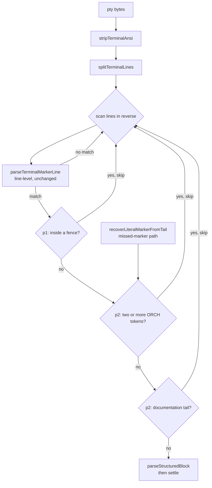

# Plan

## Phase p1 — Buffer-context scanning in findLastMarker

- [ ] t1: add fenced-code suppression to `findLastMarker` in `src/main/autopilot/pty-watcher.ts` — track ``` and ~~~ fences while scanning so a marker-shaped line inside a fence is skipped, with tests in `tests/autopilot-pty-watcher.test.ts` for a marker inside a fence, a genuine marker after the fence closes, and an unterminated fence (last fence open at buffer end suppresses to end of buffer)
  - verify: `npx vitest run tests/autopilot-pty-watcher.test.ts` — new cases green, all 36 existing assertions unchanged and passing
  - boundary.allowed: src/main/autopilot/pty-watcher.ts, tests/autopilot-pty-watcher.test.ts
  - boundary.forbidden: src/main/autopilot-council/**, src/main/**/control-channel.ts, src/main/autopilot-shared/**, src/renderer/**, .autopilot-pro/state.json
- [ ] t2: guarantee suppression never strands a run — a rejected line continues the reverse scan rather than returning null, so a genuine marker above suppressed noise is still found; test with a real marker followed by a fenced example and by the orchestrator's own nudge text
  - verify: `npx vitest run tests/autopilot-pty-watcher.test.ts`
  - boundary.allowed: src/main/autopilot/pty-watcher.ts, tests/autopilot-pty-watcher.test.ts
  - boundary.forbidden: src/main/autopilot-council/**, src/main/**/control-channel.ts, src/main/autopilot-shared/**, src/renderer/**, .autopilot-pro/state.json

## Phase p2 — Protocol-mention rules shared by both entry points

- [ ] t1: reject any line carrying two or more `[ORCH:*]` tokens — the shape of the orchestrator's missing-marker nudge and of every protocol enumeration — in both `findLastMarker` and `recoverLiteralMarkerFromTail`, via one shared helper in `src/main/autopilot/pty-watcher.ts`
  - verify: `npx vitest run tests/autopilot-pty-watcher.test.ts` — includes the verbatim nudge string from `state-machine.ts` as a fixture
  - boundary.allowed: src/main/autopilot/pty-watcher.ts, tests/autopilot-pty-watcher.test.ts
  - boundary.forbidden: src/main/autopilot-council/**, src/main/**/control-channel.ts, src/main/autopilot-shared/**, src/renderer/**, .autopilot-pro/state.json
- [ ] t2: replace `looksLikeIndentedProtocolExample`'s `<...>`-or-em-dash test with a documentation-tail rule — angle-bracket placeholders, `a|b|c` alternative lists, and protocol imperatives (`emit`, `please`) — keeping `'  [ORCH:GOAL_READY]'`, `'  [ORCH:WAITING] continue?'` and `'> [ORCH:WAITING] ready?'` parsing exactly as they do today
  - verify: `npx vitest run tests/autopilot-pty-watcher.test.ts tests/autopilot-attach-session.test.ts` — both bridge-prompt invariants still pinned, no assertion in either file modified
  - boundary.allowed: src/main/autopilot/pty-watcher.ts, tests/autopilot-pty-watcher.test.ts
  - boundary.forbidden: src/main/autopilot-council/**, src/main/**/control-channel.ts, src/main/autopilot-shared/**, src/renderer/**, tests/autopilot-attach-session.test.ts, .autopilot-pro/state.json

## Phase p3 — Callers and documentation

- [ ] t1: confirm every consumer still behaves — `output-inspector.ts` (per-line `parseTerminalMarkerLine` at lines 40/47, `findLastMarker` at line 61), the classic missed-marker path (`state-machine.ts` lines 703/746) and PRO's re-export (`autopilot-pro/state-machine.ts` line 1481) — fixing `output-inspector.ts` only if its preview provably breaks
  - verify: `npm test` && `npx tsc --noEmit -p tsconfig.node.json` && `npx tsc --noEmit -p tsconfig.web.json`
  - boundary.allowed: src/main/autopilot/output-inspector.ts, tests/autopilot-output-inspector.test.ts, src/main/autopilot/pty-watcher.ts, tests/autopilot-pty-watcher.test.ts
  - boundary.forbidden: src/main/autopilot-council/**, src/main/**/control-channel.ts, src/main/autopilot-shared/**, src/renderer/**, .autopilot-pro/state.json
- [ ] t2: rewrite the "Known issue" note under **Bridge-prompt vs marker-parser disambiguation** in `CLAUDE.md` to describe the rules that now exist, replacing the description of the heuristic being retired
  - verify: `grep -n "looksLikeIndentedProtocolExample" CLAUDE.md` reflects the shipped behaviour, and `npm test` stays green
  - boundary.allowed: CLAUDE.md
  - boundary.forbidden: src/**, tests/**, .autopilot-pro/state.json

## Notes

Sequencing is dictated by where each rule can see enough to decide. p1 establishes the
scan-with-context shape in `findLastMarker`; p2 adds rules that both entry points share
once that shape exists; p3 only observes and documents.

`parseTerminalMarkerLine` is deliberately absent from every task's edit surface. Its
contract is pinned by three tests the spec's acceptance protects, and every new rule needs
context that a single line does not carry.



Risk to watch in p2/t2: the retired heuristic rejects any tail containing `- ` via
`/[—–-]\s+/`, which is broader than it looks — a genuine tail such as
`p1/t1 - done` is currently suppressed when indented. Tightening to documentation-only
patterns makes more lines parse, not fewer, so p1's fence and multi-token rules must land
first to absorb the difference.
